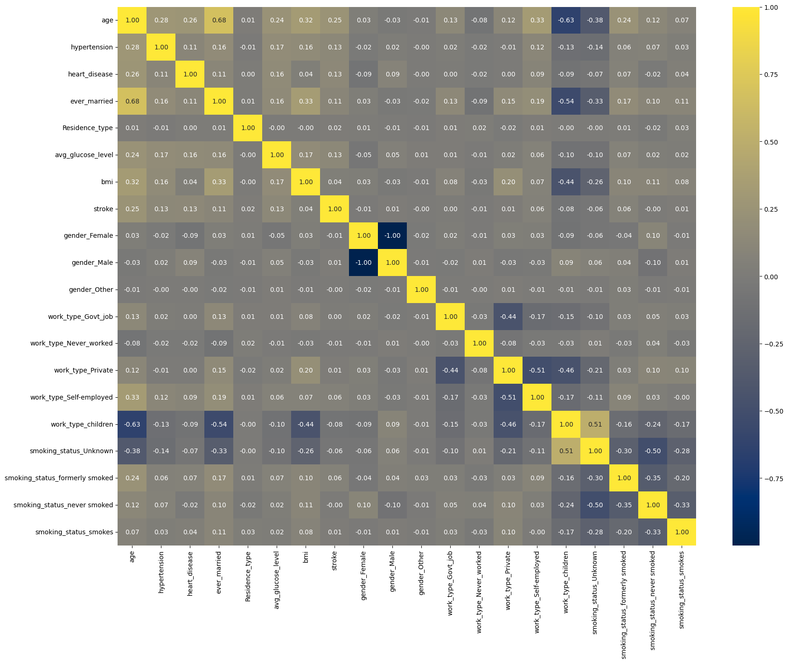

# 🚀 Proyecto: Análisis Predictivo de Ictus (EDA)

Análisis Exploratorio de Datos (EDA) sobre el dataset "Stroke Prediction" de Kaggle para identificar los factores de riesgo clave asociados a los accidentes cerebrovasculares.

---

### 1. Contexto del Problema

El objetivo de este proyecto es analizar un conjunto de datos de pacientes para entender qué variables (demográficas, de estilo de vida y médicas) tienen una mayor correlación o impacto en la probabilidad de sufrir un ictus.

### 2. Fases del Análisis

1. **Limpieza de Datos:**

   * Se identificaron valores nulos en la columna `bmi` (aprox. 3% de los datos).
   * Se decidió **imputar** estos valores usando la **mediana** en lugar de la media para evitar la influencia de valores atípicos (outliers).
2. **Análisis Univariable (Por Variable):**

   * **Desbalance Crítico:** Se detectó un fuerte desbalance en la variable objetivo (`stroke`): menos del 5% de los pacientes sufrieron un ictus.
   * **Distribuciones:** `age` está sesgada a la izquierda (más pacientes mayores), mientras `bmi` y `avg_glucose_level` están sesgadas a la derecha.
   * **Hallazgo Clave:** `avg_glucose_level` presenta una distribución **bimodal**, sugiriendo dos grupos de población (pacientes sanos y pacientes con hiperglucemia).
3. **Análisis Bivariable (Relación con Ictus):**

   * Se analizaron las variables categóricas (como `smoking_status`) usando proporciones (gráficos de relleno al 100%) para evitar conclusiones erróneas debidas al desbalance.
   * Se confirmó que `age`, `hypertension`, y `heart_disease` son los predictores individuales más fuertes.
4. **Codificación y Matriz de Correlación:**

   * Se aplicó **Label Encoding** a variables binarias (ej. `ever_married`) y **One-Hot Encoding** a variables multicategoría (ej. `work_type`).
   * La matriz de correlación final confirmó que **ninguna variable individual** tiene un poder predictivo "mágico". El riesgo de ictus es una **combinación compleja de múltiples factores**.

### 3. Hallazgos Clave (Insights)

* **El Desbalance es el Reto:** Cualquier modelo futuro deberá ser entrenado manejando este desbalance (ej. con técnicas como SMOTE o cambiando el peso de las clases).
* **La Edad es el Factor Nº1:** `age` es, con diferencia, la variable con mayor correlación (0.25).
* **Factores de Riesgo Combinados:** La hipertensión, las enfermedades cardíacas y los niveles altos de glucosa son claros factores de riesgo.

### 4. Próximos Pasos

El siguiente paso lógico tras este EDA es construir un modelo de Machine Learning. El pre-procesamiento incluiría:

1. Escalado de variables numéricas (`StandardScaler`).
2. Manejo del desbalance (`SMOTE`).
3. Entrenamiento de modelos de clasificación (Regresión Logística, Random Forest...).

### 5. Tecnologías Utilizadas

* Python
* Pandas (Manipulación de datos)
* Matplotlib & Seaborn (Visualización)
* Jupyter Notebook
